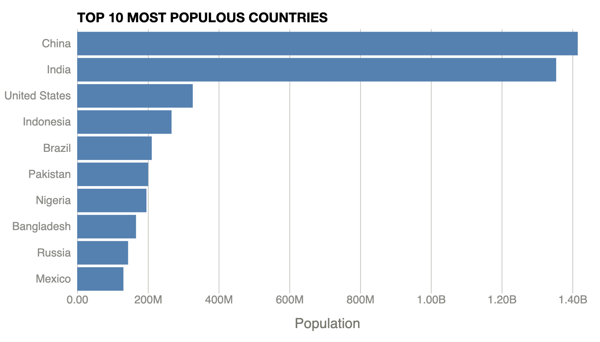

# Basic Charts with D3.js
This repository included series of basic chart creation with D3.js. 

The tutorial video is on FreeCodeCamp.org made by Curran Kelleher: https://www.youtube.com/watch?v=_8V5o2UHG0E

This repository used [rollup.js](https://rollupjs.org/) as the JavaScript module bundler.

## Screenshot of Chart from Branches
### Branch: main


### Branch: customizing-axes-of-bar-chart


### Branch: area-chart


### Branch: area-chart-world-population


### Branch: line-chart


### Branch: scatter-plot


## View the outcome
Open `public/index.html` in modern browser such as Chrome or Firefox directly. 

## Further development
To further develop the project by updating JavaScript, can run

```javascript

npm run bulid

```

or **watch** changes and auto compile:
```javascript
npm run watch
```

### Note for rollup.config.js settings
The output file format must be 'iife' to make advanced function work. 